This document will cover the process of adding elements to the Zookeeper Distributed Queue in the Broadleaf Commerce framework. The process includes the following steps:

1. Adding all elements to the queue
2. Writing to the queue
3. Locking the queue
4. Deleting the queue
5. Checking if the queue contains all elements
6. Checking if the queue is empty
7. Adding an element to the queue
8. Checking the size of the queue.

```mermaid
graph TD;
subgraph core/broadleaf-framework/src/main/java/org/broadleafcommerce/core/util
  addAll:::mainFlowStyle --> writeToQueue
end
subgraph core/broadleaf-framework/src/main/java/org/broadleafcommerce/core/util
  writeToQueue:::mainFlowStyle --> tryLock
end
subgraph core/broadleaf-framework/src/main/java/org/broadleafcommerce/core/util
  tryLock:::mainFlowStyle --> lockInternally
end
subgraph core/broadleaf-framework/src/main/java/org/broadleafcommerce/core/util
  lockInternally:::mainFlowStyle --> delete
end
subgraph core/broadleaf-framework/src/main/java/org/broadleafcommerce/core/util
  delete --> contains
end
subgraph core/broadleaf-framework/src/main/java/org/broadleafcommerce/core/util
  contains --> containsAll
end
subgraph core/broadleaf-framework/src/main/java/org/broadleafcommerce/core/util
  containsAll --> isEmpty
end
subgraph core/broadleaf-framework/src/main/java/org/broadleafcommerce/core/util
  containsAll --> readQueueInternal
end
subgraph core/broadleaf-framework/src/main/java/org/broadleafcommerce/core/util
  isEmpty --> size
end
subgraph core/broadleaf-framework/src/main/java/org/broadleafcommerce/core/util
  readQueueInternal:::mainFlowStyle --> put
end
subgraph core/broadleaf-framework/src/main/java/org/broadleafcommerce/core/util
  readQueueInternal:::mainFlowStyle --> lockInterruptibly
end
subgraph core/broadleaf-framework/src/main/java/org/broadleafcommerce/core/util
  put:::mainFlowStyle --> add
end

classDef mainFlowStyle color:#000000,fill:#7CB9F4
classDef rootsStyle color:#000000,fill:#00FFF4
classDef Style1 color:#000000,fill:#00FFAA
classDef Style2 color:#000000,fill:#FFFF00
classDef Style3 color:#000000,fill:#AA7CB9
```



<SwmSnippet path="/core/broadleaf-framework/src/main/java/org/broadleafcommerce/core/util/queue/ZookeeperDistributedQueue.java" line="359">

---

# Adding all elements to the queue

The `add` method is used to add a single element to the queue. If the queue is full, an exception is thrown.

```java
    @Override
    public boolean add(T e) {
        try {
            final ArrayList<T> lst = new ArrayList<>();
            lst.add(e);
            int count = writeToQueue(lst, 0L);
            if (count != 1) {
                throw new IllegalStateException("The Zookeeper queue was full.");
            } else {
                return true;
            }
        } catch (InterruptedException ex) {
            Thread.currentThread().interrupt();
            return false;
        }
    }
```

---

</SwmSnippet>

<SwmSnippet path="/core/broadleaf-framework/src/main/java/org/broadleafcommerce/core/util/queue/ZookeeperDistributedQueue.java" line="503">

---

# Writing to the queue

The `writeToQueue` method is used to write a list of entries to the queue. If the queue is full or the lock cannot be acquired, the method returns the number of entries that were successfully added.

```java
    protected int writeToQueue(List<? extends T> entries, final long timeout) throws InterruptedException {
        if (entries == null || entries.isEmpty()) {
            return 0;
        }
        
        int entryCount = 0;
        long waitTime = timeout;
        synchronized (QUEUE_MONITOR) {
            while (true) {
                boolean locked = false;
                DistributedLock lock = getQueueAccessLock();
                if (timeout < 0L) {
                    lock.lockInterruptibly();
                    locked = true;
                } else if (timeout > 0L && waitTime > 0L) {
                    long start = System.currentTimeMillis();
                    locked = lock.tryLock(waitTime, TimeUnit.MILLISECONDS);
                    long end = System.currentTimeMillis();
                    waitTime -= (end - start);
                } else {
                    locked = lock.tryLock();
```

---

</SwmSnippet>

<SwmSnippet path="/core/broadleaf-framework/src/main/java/org/broadleafcommerce/core/util/lock/ReentrantDistributedZookeeperLock.java" line="344">

---

# Locking the queue

The `tryLock` method is used to acquire a lock on the queue. If the lock cannot be acquired, the method returns false.

```java
    @Override
    public boolean tryLock() {
        try {
            return lockInternally(0L);
        } catch (InterruptedException e) {
            Thread.currentThread().interrupt();
            return false;
        }
    }
```

---

</SwmSnippet>

<SwmSnippet path="/core/broadleaf-framework/src/main/java/org/broadleafcommerce/core/util/dao/CodeTypeDaoImpl.java" line="51">

---

# Deleting the queue

The `delete` method is used to delete a CodeType object from the queue.

```java
    public void delete(CodeType codeType) {
        if (!em.contains(codeType)) {
            codeType = (CodeType) em.find(CodeTypeImpl.class, codeType.getId());
        }
        em.remove(codeType);
    }
```

---

</SwmSnippet>

<SwmSnippet path="/core/broadleaf-framework/src/main/java/org/broadleafcommerce/core/util/queue/ZookeeperDistributedQueue.java" line="285">

---

# Checking if the queue contains all elements

The `containsAll` method is used to check if the queue contains all elements in a given collection.

```java
    @Override
    public boolean containsAll(Collection<?> c) {
        DistributedLock lock = getQueueAccessLock();
        try {
            lock.lockInterruptibly();
            try {
                Map<String, T> elements = readQueueInternal(geMaxCapacity(), false, 0L);
                if (!elements.isEmpty()) {
                    return elements.values().containsAll(c);
                }
                
                return false;
                
            } finally {
                lock.unlock();
            }
        } catch (InterruptedException e) {
            Thread.currentThread().interrupt();
            throw new DistributedQueueException("The thread was interrupted while trying to determine if elements are contained in the Zookeeper queue, " + getQueueFolderPath(), e);
        }
    }
```

---

</SwmSnippet>

<SwmSnippet path="/core/broadleaf-framework/src/main/java/org/broadleafcommerce/core/util/queue/ZookeeperDistributedQueue.java" line="262">

---

# Checking if the queue is empty

The `isEmpty` method is used to check if the queue is empty.

```java
    @Override
    public boolean isEmpty() {
        synchronized (QUEUE_MONITOR) {
            return size() == 0;
        }
    }
```

---

</SwmSnippet>

<SwmSnippet path="/core/broadleaf-framework/src/main/java/org/broadleafcommerce/core/util/queue/ZookeeperDistributedQueue.java" line="393">

---

# Adding an element to the queue

The `put` method is used to add an element to the queue.

```java
    @Override
    public void put(T e) throws InterruptedException {
        final ArrayList<T> elementsToAdd = new ArrayList<>();
        elementsToAdd.add(e);
        writeToQueue(elementsToAdd, -1L);
    }
```

---

</SwmSnippet>

<SwmSnippet path="/core/broadleaf-framework/src/main/java/org/broadleafcommerce/core/util/queue/ZookeeperDistributedQueue.java" line="238">

---

# Checking the size of the queue

The `size` method is used to get the number of elements in the queue.

```java
    @Override
    public int size() {
        DistributedLock lock = getQueueAccessLock();
        try {
            lock.lockInterruptibly();
            try {
                return executeOperation(new GenericOperation<Integer>() {
                    @Override
                    public Integer execute() throws Exception {
                        final Stat stat = new Stat();
                        getZookeeperClient().getData(getQueueEntryFolder(), null, stat);
                        return stat.getNumChildren();
                    }
                });
                
            } finally {
                lock.unlock();
            }
        } catch (InterruptedException e) {
            Thread.currentThread().interrupt();
            throw new DistributedQueueException("Thread was interrupted while trying to determine queue size for distributed Zookeeper queue, " + getQueueFolderPath(), e);
```

---

</SwmSnippet>

&nbsp;

*This is an auto-generated document by Swimm AI 🌊 and has not yet been verified by a human*

<SwmMeta version="3.0.0" repo-id="Z2l0aHViJTNBJTNBQnJvYWRsZWFmQ29tbWVyY2UtZGVtbyUzQSUzQWdpbGFkbmF2b3Q=" repo-name="BroadleafCommerce-demo" doc-type="flows"><sup>Powered by [Swimm](/)</sup></SwmMeta>
